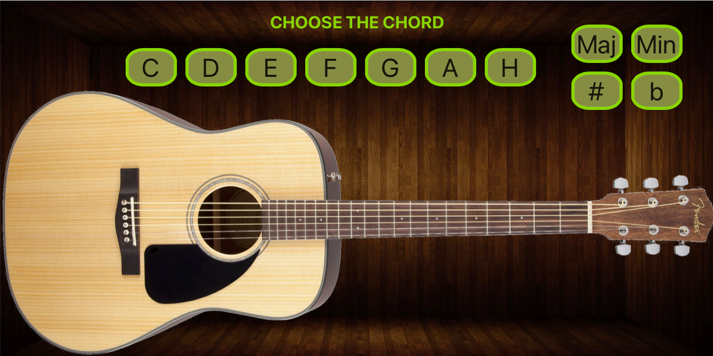

# Guitar-Chords
Interactive Guitar Chords one page site on React.

[Visit the site](https://guitar-chords-react.netlify.app)

Here you can find basic guitar chords for begginers with demonstration on virtual guitar.

## Visual

## Usage

Just click on the button of required chord and you will see visually on guitar spots for your fingers.
Enjoy :)

## License

[MIT](https://choosealicense.com/licenses/mit/)
